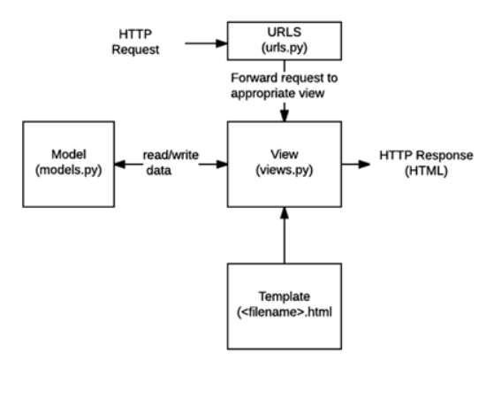
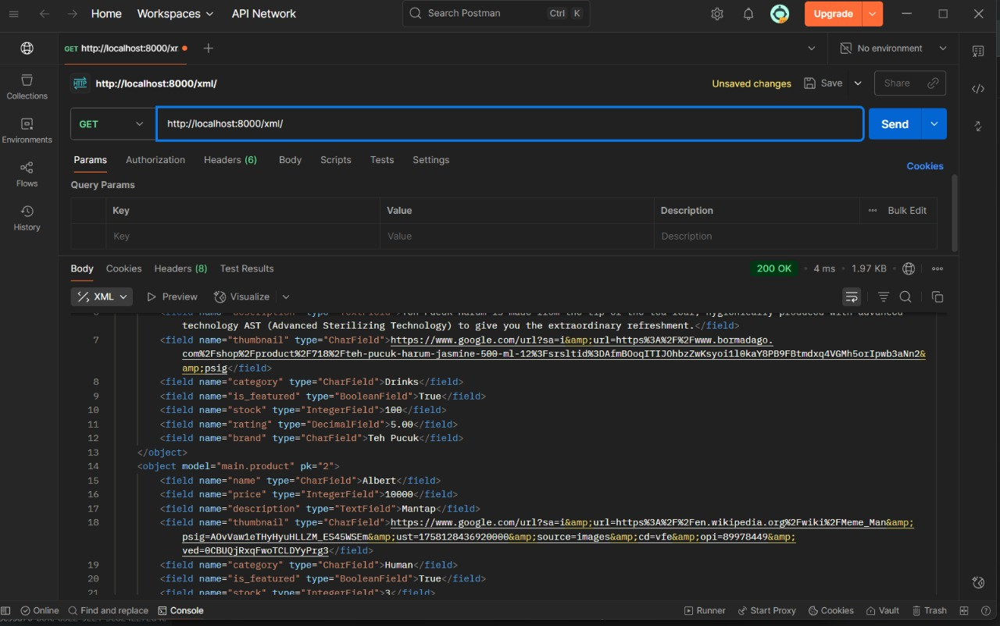
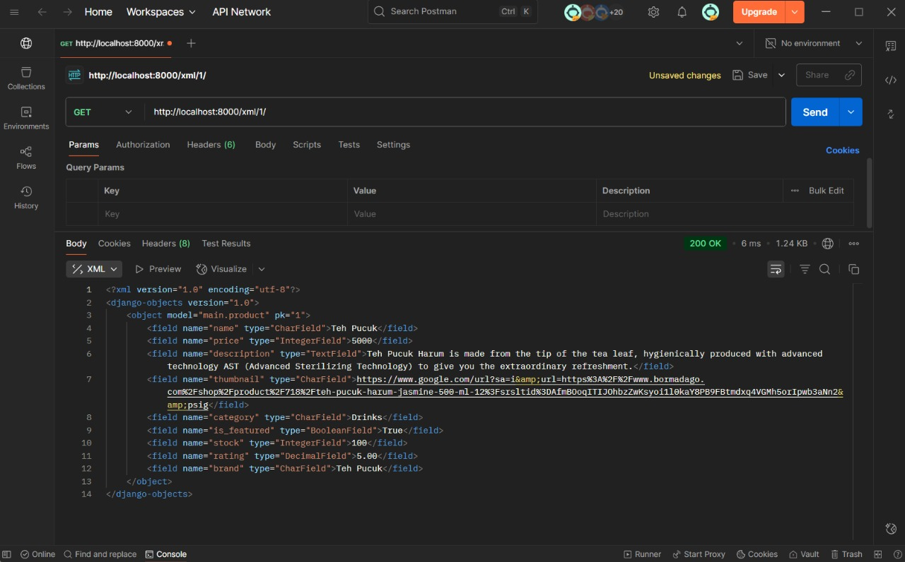
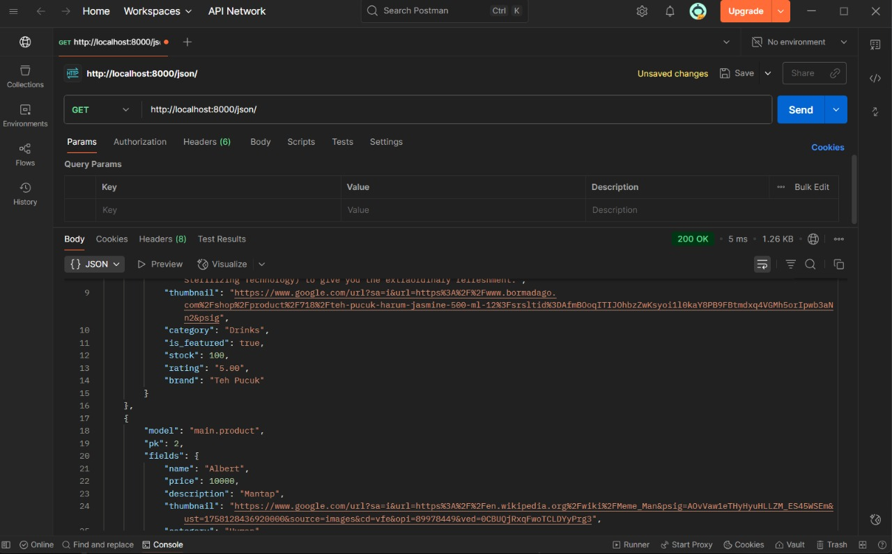
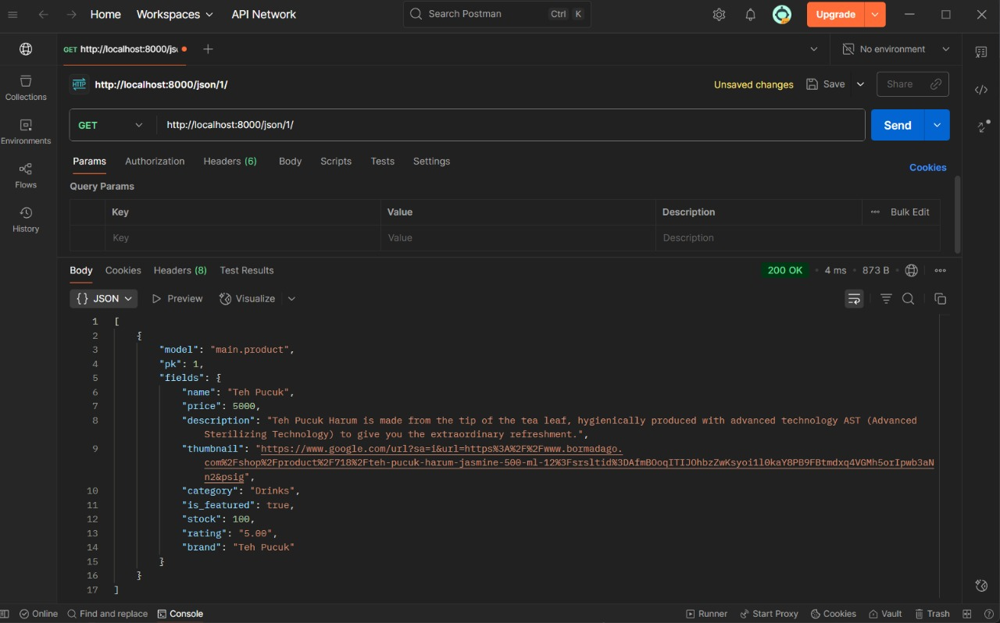

### ASSIGNMENT 2
Link to PWS: https://pbp.cs.ui.ac.id/web/project/muhammad.vegard/footballshop

1. Explain how you implemented the checklist above step-by-step:

First, I created a new Django project and then generated an application named main inside it. After that, I made sure the application was registered in the project’s settings so Django could recognize it. To make the app the default entry point, I configured the main urls.py to include the routes defined in the main app.

Next, I built a Product model inside the main app with all the requested fields: name and category as character fields, price as an integer, description as a text field, thumbnail as a URL, and is_featured as a boolean. This provided the data structure for storing product information.

I then created a simple function in views.py that returned an HTML template. This template displayed the application name, my own name, and my class. To connect everything, I defined routes in the main/urls.py file that mapped directly to the view function.

Finally, I prepared the project for deployment to Pacil Web Service (PWS). This involved creating a project on the PWS dashboard, saving the provided credentials, configuring environment variables, and updating the settings.py file to include the deployment URL in ALLOWED_HOSTS. After committing and pushing the code to the remote repository, I deployed the app through PWS. Once the deployment status turned to “Running,” the project was accessible online for peers to view.

2. Create a diagram showing the client request to the Django-based web application and its response, and explain the relationship between urls.py, views.py, models.py, and the HTML file in the diagram.

Diagram: 


HTTP Request → urls.py: When a client (browser) makes a request, Django first checks urls.py. This file acts like a traffic controller — it decides which view should handle the incoming URL.

urls.py → views.py: Once the request is matched, it is forwarded to the corresponding function (or class) inside views.py. The view is where the main logic lives: it decides whether to fetch data, process input, or simply render a page.

views.py ↔ models.py: If the view needs data from the database, it communicates with models.py. Models define the structure of the data and allow Django to read or write to the database through the ORM.

views.py → template (HTML): After gathering the necessary data, the view passes it into a template (.html file). Templates are responsible for presentation — they display the data in a user-friendly way using Django’s template language.

Template → HTTP Response: Finally, the template is rendered into a complete HTML page, which is sent back as the HTTP response to the client’s browser.

3. Explain the role of settings.py in a Django project!

In Django, the settings.py file is the main configuration hub of a project. It controls how the entire application behaves, both in development and in production. Instead of scattering configurations across different files, Django centralizes them in settings.py, making the project easier to manage and customize.
Some of the key roles of settings.py include:

~ Application setup: It lists all active apps in INSTALLED_APPS and middleware in MIDDLEWARE, which define what features and tools Django should load.

~ Database connection: It specifies database details such as engine, name, user, and password, so the project can connect and interact with data.

~ Static files and templates: It defines where CSS, JavaScript, images, and HTML templates are located and how Django should serve them.

~ Security: It holds sensitive configurations like SECRET_KEY, DEBUG, and ALLOWED_HOSTS, which ensure the project runs safely in different environments.

~ Localization: It manages language, timezone, and formatting to support users in different regions.

4. How does database migration work in Django?

In Django, database migration is the process of keeping your database schema (tables, columns, relationships) in sync with the models you define in your code. Instead of manually altering the database, Django automates this through migration files and commands.

~ Model changes: When you add, remove, or modify fields in your models (models.py), Django detects these changes.

~ Migration files: Running python manage.py makemigrations generates migration files inside the app’s migrations/ folder. These files are like versioned instructions that describe how the database should change (e.g., “add a new column price to the Product table”).

~ Applying migrations: Running python manage.py migrate applies those migration files to the actual database. Django translates them into SQL commands behind the scenes, updating tables without you writing SQL manually.

~ Version control: Each migration is numbered and linked, so Django knows the history of your database schema and can roll forward or backward if needed.

5. In your opinion, among all existing frameworks, why is the Django framework chosen as the starting point for learning software development?

In my opinion, Django gives a beginners a complete, structured, and practical environment to build real applications. Instead of forcing you to piece together many tools, Django comes with almost everything you need out of the box. In other words, beginner-friendly and very easy to use.

6. Do you have any feedback for the teaching assistant for Tutorial 1 that you previously completed?

So far, the explanation for the tutorial is clear, easy to understand.


### ASSIGNMENT 3

### 1. Why do we need data delivery in implementing a platform?
Data delivery is essential because platforms often consist of multiple components (frontend, backend, databases, third-party services) that need to communicate. By delivering data in a structured format (such as JSON or XML), platforms can exchange information consistently, enabling interoperability, scalability, and real-time updates between different systems.

---

### 2. In your opinion, which is better, XML or JSON? Why is JSON more popular than XML?
JSON is generally better for modern applications because it is lightweight, human-readable, and directly compatible with JavaScript (commonly used in web development). JSON also requires less storage and bandwidth compared to XML.  

XML, while more verbose, is useful in scenarios requiring strict document validation and complex data structures.  

✅ JSON is more popular today because most APIs, mobile apps, and web apps prioritize speed and simplicity.

---

### 3. What is the purpose of the `is_valid()` method in Django forms, and why do we need it?
The `is_valid()` method checks whether the data entered into a form meets the validation rules defined by the form and model fields.  

- It ensures that the submitted data is **safe, complete, and correctly formatted** before saving it to the database.  
- Without `is_valid()`, invalid or malicious data could break the application or compromise security.  

---

### 4. Why do we need a `csrf_token` when making forms in Django?  
The `csrf_token` (Cross-Site Request Forgery token) protects Django applications from **CSRF attacks**, where a malicious site tricks a logged-in user into submitting unwanted requests (e.g., transferring money, deleting data).  

- If we don’t include a `csrf_token`, attackers can forge requests on behalf of users without their knowledge.  
- This can lead to **compromised user accounts and data integrity**.  

---

### 5. Explain how you implemented the checklist above step-by-step
1. Defined the `Product` model with attributes like `name`, `price`, `category`, etc.  
2. Created views to return data in **JSON** and **XML** formats, including filtering by ID.  
3. Added **URL routes** for each new view.  
4. Built a product listing page (`main.html`) with **"Add"** and **"Detail"** buttons.  
5. Implemented a form page (`create_product.html`) for adding new products using Django forms.  
6. Created a detail page (`product_detail.html`) to display full product info.  
7. Tested the API endpoints in **Postman** and confirmed responses for JSON, XML, and by ID.  
8. Committed and pushed the final version to GitHub, and linked screenshots in the README.  

---

### 6. Do you have any feedback for the teaching assistants for Tutorial 2?
Actually, there is a minor mistake in the Tutorial **“Creating Data Input Form and Displaying Football News Data on HTML”** section, step no. 3.  

The tutorial shows this code:
```python
urlpatterns = [
    path('', show_main, name='show_main')
    path('create-news/', create_news, name='create_news'),
    path('news/<str:id>/', show_news, name='show_news'),
]
```
Right after "path('', show_main, name='show_main')" there should be a comma. Since the tutorial skipped it, I ran into an error and had a small panic before realizing to fix.

###  Postman Screenshots

Below are the results of accessing the four URLs using Postman:

- **XML**  
  

- **XML by ID**  
  

- **JSON**  
  

- **JSON by ID**  
  


## Assignment 4: Authentication, Session, Cookies, and Selenium

### 1. What is Django's `AuthenticationForm`? Explain its advantages and disadvantages.
`AuthenticationForm` is a built-in Django form used for handling user login. It checks the provided username and password against Django’s authentication backend.

**Advantages:**
- Saves development time because it is pre-built and ready to use.
- Secure by default (handles password hashing and validation).
- Easy integration with Django’s `LoginView` and custom views.
- Automatically shows useful error messages (e.g., “invalid username or password”).

**Disadvantages:**
- Limited customization out of the box (must be subclassed for custom styling or fields).
- Tightly coupled with Django’s default authentication system.
- Might not fit projects needing OAuth, JWT, or other external authentication flows.

---

### 2. What is the difference between authentication and authorization? How does Django implement the two concepts?
- **Authentication**: Process of verifying a user’s identity (e.g., logging in with username/password).  
- **Authorization**: Process of deciding what an authenticated user is allowed to do (permissions, groups, roles).  

**In Django:**
- Authentication is handled by `django.contrib.auth`, with models like `User` and built-in views/forms such as `AuthenticationForm`.
- Authorization is handled by Django’s **permissions** (`is_staff`, `is_superuser`, or custom model permissions) and **decorators** like `@login_required` or `@permission_required`.

---

### 3. What are the benefits and drawbacks of using sessions and cookies in storing the state of a web application?
**Benefits:**
- Allow persistence of user state across requests (e.g., stay logged in).
- Sessions are stored server-side, while cookies only hold a session ID → safer than storing full data in cookies.
- Cookies enable features like “Remember Me” and shopping carts.

**Drawbacks:**
- Sessions require storage (database, cache, or file system).
- Cookies can be stolen (via XSS) or intercepted if not secured with HTTPS.
- Improper session handling can lead to security risks (e.g., session fixation).

---

### 4. In web development, is the usage of cookies secure by default, or is there any potential risk that we should be aware of? How does Django handle this problem?
- Cookies **are not secure by default**. Risks include:
  - **XSS attacks** stealing cookies.
  - **Session hijacking** if cookies are sent over HTTP instead of HTTPS.
- **How Django handles this:**
  - Supports `HttpOnly` cookies → prevents JavaScript access.
  - Supports `Secure` flag → cookies only sent over HTTPS.
  - Session framework stores sensitive data on the server, only session keys go into cookies.
  - Built-in CSRF protection to prevent cross-site request forgery.

---

### 5. Explain how you implemented the checklist above step-by-step (not just following the tutorial).
1. Implemented user authentication (`login_user`, `logout_user`, `register` views) using Django’s `AuthenticationForm`.
2. Created login, register, and logout templates and linked them with URLs.
3. Added session tracking using `request.COOKIES['last_login']` and displayed it in the main page.
4. Applied `@login_required` to restrict product list access only to authenticated users.
5. Modified templates (`main.html`, `product_detail.html`) to show seller info, last login, and filter buttons (All / My Products).
6. Added a custom template filter `rupiah` to format product prices into Indonesian Rupiah.
7. Tested login, logout, and cookies behavior to ensure sessions update correctly.

---

## Assignment 5: CSS, Responsive Design, and Layout

### 1. CSS Selector Priority  
If multiple CSS selectors target the same HTML element, the **priority order** is:  
1. **Inline styles** (`style="..."`) → highest priority.  
2. **IDs** (`#id`).  
3. **Classes, attributes, pseudo-classes** (`.class`, `[type=text]`, `:hover`).  
4. **Elements and pseudo-elements** (`div`, `h1`, `::before`).  

- If two rules have equal specificity, the **later rule** in the CSS wins.  
- `!important` overrides all normal rules.  

---

### 2. Responsive Design  

**Why is it important in web application development?**  
- Ensures applications work on all devices (desktop, tablet, mobile).  
- Improves **user experience** and accessibility.  
- Prevents layout breaking (e.g., overflow, horizontal scrolling).  

**Examples:**  
- ✅ **Good:** Nike.com, Apple.com → fluid grids, responsive images, adaptive navigation.  
- ❌ **Bad:** Older fixed-width sites → break on mobile screens, force zoom/scroll.  

**Reason:**  
Responsive design uses **media queries, flexible layouts, and scalable units**, while non-responsive sites rely on fixed pixel widths.  

---

### 3. Box Model  
The CSS box model consists of:  
- **Content** → text, image, or element content.  
- **Padding** → space inside the element, between content and border.  
- **Border** → line around the element’s padding and content.  
- **Margin** → space outside the border, separating elements.  

Example:  
```css
.card {
  margin: 1rem;               /* outside spacing */
  padding: 1rem;              /* inside spacing */
  border: 2px solid #6d28d9;  /* border */
  box-sizing: border-box;     /* predictable sizing */
}
```
### 4. Layout Systems
- **Flexbox** → one-dimensional layout (row or column). Best for navbars, toolbars, or evenly spaced elements.
  ```css
  .nav { display:flex; gap:1rem; justify-content:space-between; }
  ```
- **Grid** → two-dimensional layout (rows + columns). Best for dashboards, product listings, or galleries.
  ```css
  .grid {
  display: grid;
  grid-template-columns: repeat(auto-fit, minmax(280px, 1fr));
  gap: 1.25rem;
  }
  ```
### 5. Explain how you implemented the checklist above step-by-step (not just following the tutorial).  
1. Updated **navbar** with new title *Sports Universe*, recolored using a **galaxy gradient**, and made it responsive with category filters (Shoes, Apparel, Hardware, Stores, Accessories, Balls).  
2. Implemented **product list page** using **cards** with a dark galaxy background and bright content for contrast.  
3. Handled empty state by adding a `no-product.png` image and message when no products exist.  
4. Created a **category dropdown** in product form using `CATEGORY_CHOICES` with fallback option “Others”.  
5. Fixed **case sensitivity** in categories (e.g., “Shoes” vs “shoes”) by normalizing user input before filtering.  
6. Added and configured **custom `rupiah` template filter** in `templatetags/currency.py` for price formatting.  
7. Applied **@login_required** to restrict Add, Edit, and Delete product access only to authenticated users.  
8. Styled **login and register pages** with galaxy background while keeping form cards bright for readability.  
9. Implemented **responsive grid** for products using CSS Grid with `auto-fit` and media queries.  
10. Tested all filters (All / My Products, categories), empty state, and authentication flows to ensure functionality.  

  
## 📌 Changelog

All notable changes to this project will be documented in this section.

### [1.4.0] - 2025-10-1
- Updated Branding
  - Football Shop -> Sports Universe
- Theme
  - Galaxy Theme Background
  - Gradient navbar and consistent bright cards/forms
- Navigation
  - Responsive navbar with hamburger menu
  - Added category links to navbar
- Products
  - Card layout (`card_product.html`) in responsive grid
  - Empty state with image + CTA
  - Category filter using Product.CATEGORY_CHOICES
  - “All Products / My Products” filter
- Forms & Details
  - Category dropdown (no free text)
  - Styled create/edit/detail pages
- Auth & Permissions
  - Protected add/edit/delete routes with `@login_required`
  - Owner-only edit/delete buttons
- Price Filter
  - Rupiah currency filter implemented in `templatetags/currency.py`
- Static Fixes
  - Correct static file setup for images and CSS

### [1.3.0] - 2025-09-21
- Added custom Rupiah currency filter (`{{ value|rupiah }}`) for price formatting
- Changed “Author” label to “Seller” in product details
- Implemented product list filter (All Products / My Products)
- Added `last_login` session tracking in main page

### [1.2.0] - 2025-09-14
- Added product detail page with:
  - Thumbnail image
  - Stock, rating, and brand display
  - Linked each product to its seller (user)
- Updated templates to show seller info

### [1.1.0] - 2025-09-07
- Implemented authentication features:
  - User login and logout
  - Registration form with validation
  - Session and cookies handling
- Protected main product list with `@login_required`

### [1.0.0] - 2025-08-28
- Initial project setup (Tutorials 0–2):
  - Configured Git & Django project
  - Created base Django app (`main`)
  - Implemented first models (`Product`)
  - Added product creation form and object listing
  - Integrated database (SQLite3)